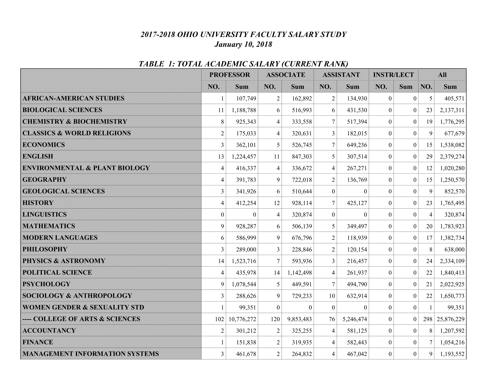
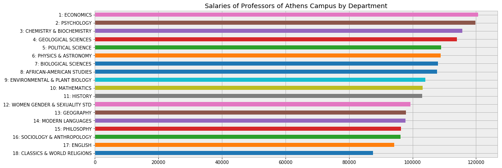
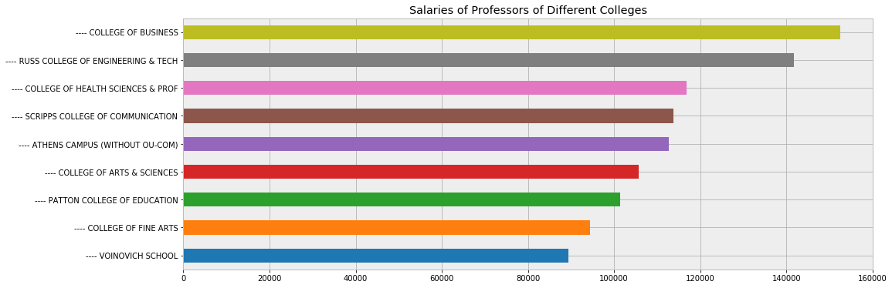

# Analysis Salaries of Ohio University Professors

In this project my goal was to find and compare the salaries of professors of Ohio University according to Colleges and departments. I got the salary data from the [HR website](https://www.ohio.edu/instres/faculty/AAUP1718.pdf) for the year of 
2018 and did some data wrangling and vizualization.

We can view the rendered version of notebook using [nbviewer](https://nbviewer.jupyter.org/github/bhishanpdl/Portfolio/blob/master/Analysis_of_OU_Profs_Salaries/ou_prof_salaries_by_dept.ipynb).

The data format was pdf and the preview of first page is given below:

# Results
The "Economics" professors make a lot of many comparison to other departments in Ohio University Athnes Campus compared to 
other department professors, followed by "Psychology". The department of "Physics and Astronomy" comes at number 6.

Among the colleges in Ohio University "The College of Business" gives the highest average salaries to its professors, followed by "Engineering College". "Voinovich School" gives the lowest average salary to its professors.

