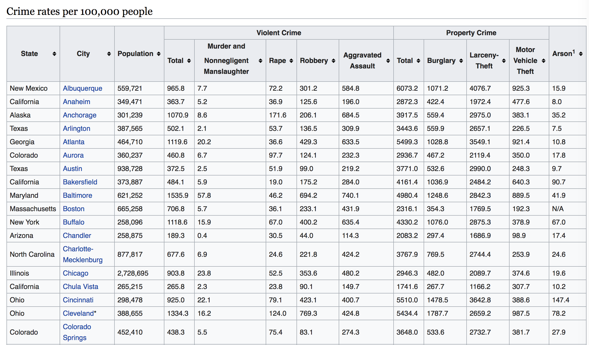
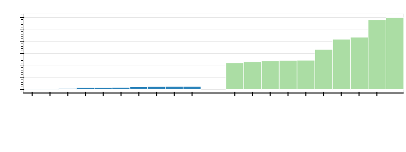
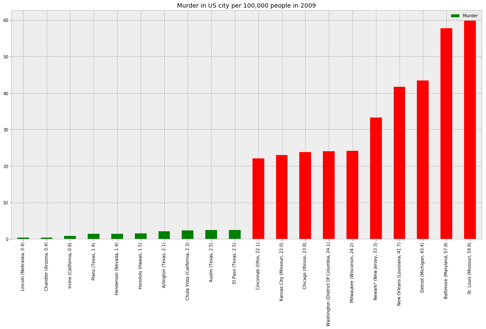

# Analysis of Crime Rates in USA Cities
Data: https://en.wikipedia.org/wiki/List_of_United_States_cities_by_crime_rate

# Analysis
In this project I took the data of crime rates in US cities. I could not find the latest data, the data I found was
in wikipedia and it was for the year 2009. The data for this year can be different and different cities might have different
crime rates now. But the tools used and analysis done can be transferred from this study to the latest data study easily.

In this simple project, we can learn the use of `request` library to scrape the data from websites, and then use `pandas`
to clean up and analyze the data and finally use `bokeh` to get some nice and interactive visualizations.

# Results Summary:
- The city "Lincoln" of Nebraska was the lower murder rate city in 2009.
- The city "St. Louis" of Missouri was the highest murder rate city in 2009.

# Sneak peek of data
The first page of the crime data looks like this:

# Source code
The jupyter notebook can be viewed [here](http://nbviewer.ipython.org/github/bhishanpdl/Project--Crime_Rates_in_US_Cities/tree/master).

# Final Results
The interactive result [can be found here](http://htmlpreview.github.io/?https://github.com/bhishanpdl/Project--Crime_Rates_in_US_Cities/blob/master/plot.html)

The crime rates of cities based on highest and lowest murder rate is found as below.

