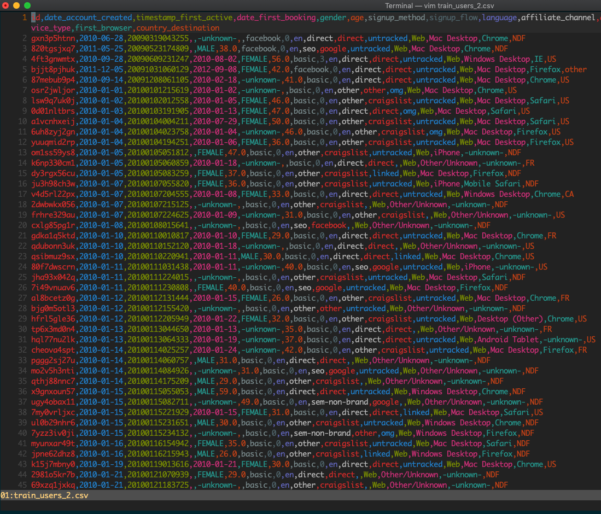
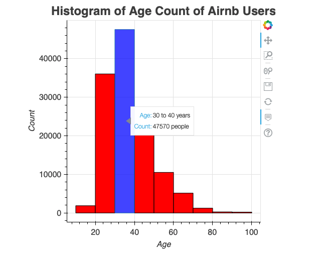
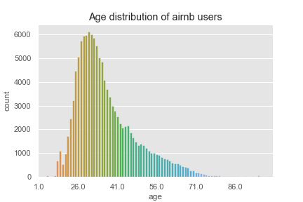
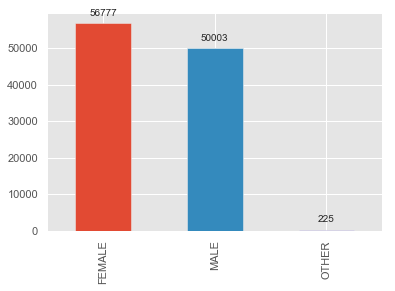

# kaggle project of Airnb Data Analysis

In this project I took the data from [Kaggle Airnb New User Bookings Project](https://www.kaggle.com/c/airbnb-recruiting-new-user-bookings/data). I studied the age distribution of Airnb users. The age was taken between 10 years and 100 years after cleaning the data. Also, the gender-wise registration was studied and plots are created.

# Sneak peek of the data

# Source Code

The jupyter notebook can be viewed [here](http://nbviewer.ipython.org/github/bhishanpdl/Project--Kaggle_Airnb_Data_Analysis/tree/master).

# Results
The interactive output can be found [here](http://htmlpreview.github.io/?https://github.com/bhishanpdl/Project--Kaggle_Airnb_Data_Analysis/blob/master/airnb_age.html).

