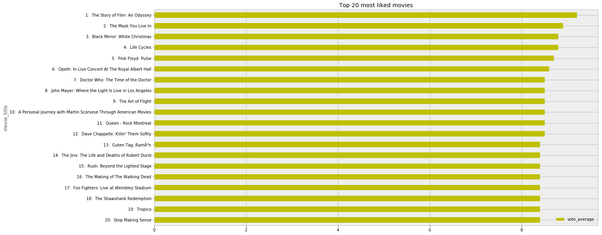

# Project--Kaggle_TMDB_Data_Analysis

TMDB stands for [The Movie Database](https://www.themoviedb.org/). 

Data source: https://www.kaggle.com/tmdb

# Project Goal
+ Find top 20 budget, profit, and rating
  - Find top 20 most expensive movies.
  - Find top 20 highest profitable movies.
  - Find top 20 highest rated movies.
+ Find which month has the most release.
+ Find number of production of movies by year.
+ Find which genre is the most popular.
  - Find the total count of the genres for movies.
  - Find the total budget per genre.

# Results

