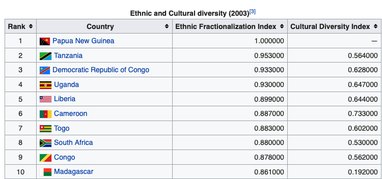
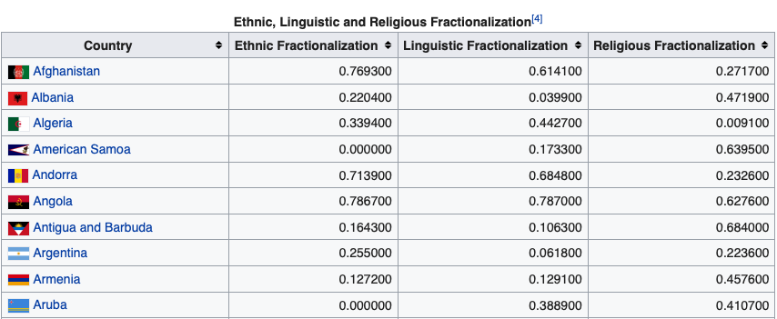
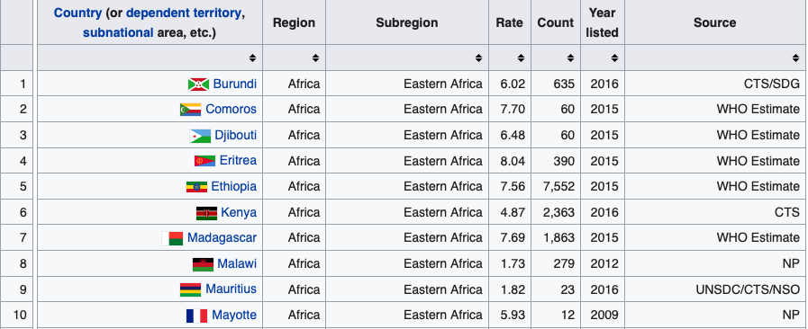
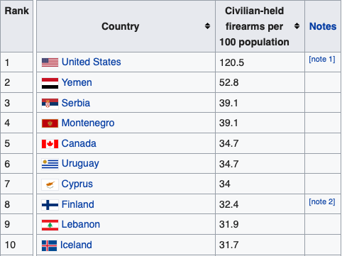
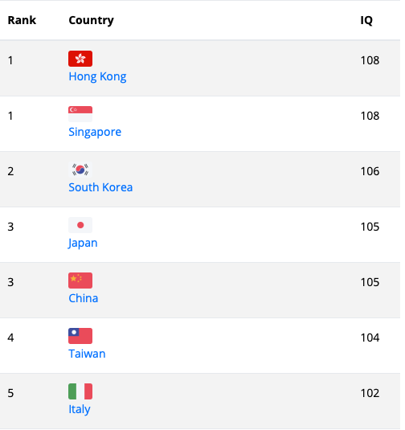

This weekend I did a project on influence of ethnic and cultural diversity on murder rate. There are many factors that
affect the murder rate in a counry. Among them I anlyzed following:
```
1. Ethnic Diversity
2. Cultural Diversity
3. Ethnic Fractionalization
4. Religious Fractionalization
5. Linguistic Fractionalization
6. Guns per 100 residents
7. Average IQ score of the country
```

The notebook can be viewed [here](http://nbviewer.ipython.org/github/bhishanpdl/Projects/tree/master).

# Data Source
[ethnic cultural wikipedia](https://en.wikipedia.org/wiki/List_of_countries_ranked_by_ethnic_and_cultural_diversity_level)

[ethnic linguistic wikipedia next table](https://en.wikipedia.org/wiki/List_of_countries_ranked_by_ethnic_and_cultural_diversity_level)

[homicide wikipedia](https://en.wikipedia.org/wiki/List_of_countries_by_intentional_homicide_rate)

[guns per capita wikipedia](https://en.wikipedia.org/wiki/Estimated_number_of_civilian_guns_per_capita_by_country)

[IQ by country](https://new-iq-test.com/iq-by-country/)

# Dependencies
- numpy
- pandas
- bs4
- matplotlib
- seaborn

# Input data






# Result images
![outputs/Ethnic_diversity_rank_vs_Murder_rate.png)
![outputs/Cultural_diversity_index_vs_Murder_rate.png)
![outputs/Ethnic_fractionalization_index_vs_Murder_rate.png)
![outputs/Religious_fractionalization_vs_Murder_rate.png)
![outputs/Linguistic_fractionalization_vs_Murder_rate.png)
![outputs/Guns_per_100_residents_vs_Murder_rate.png)
![outputs/IQ_vs_Murder_rate.png)


