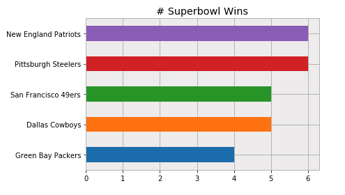
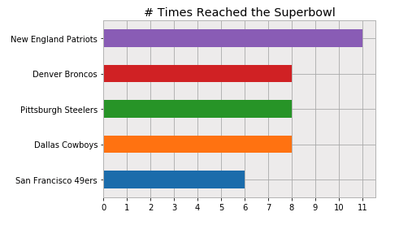
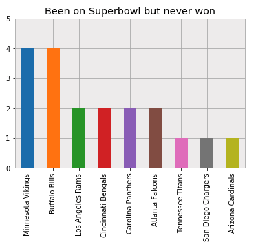

Table of Contents
=================
   * [Introduction](#introduction)
   * [Where are the NFL Teams located?](#where-are-the-nfl-teams-located)
   * [Who has won the superbowl most times?](#who-has-won-the-superbowl-most-times)
   * [Who has reached superbowl most times?](#who-has-reached-superbowl-most-times)
   * [Who has won consecutively two times?](#who-has-won-consecutively-two-times)
   * [Who has lost consecutively two times?](#who-has-lost-consecutively-two-times)
   * [Who has been on superbowl but never won?](#who-has-been-on-superbowl-but-never-won)
   * [Who has never been on superbowl?](#who-has-never-been-on-superbowl)

# Introduction
Just after watching Superbowl LIII between New England Patriots vs. Los Angels Rams
I was intrigued at the data science approach towards the concept of superbowl games. So I spent some time spending 
answers to some of the superbowl related questions.

# Where are the NFL Teams located?

# Who has won the superbowl most times?

# Who has reached superbowl most times?

# Who has won consecutively two times?

# Who has lost consecutively two times?

# Who has been on superbowl but never won?

# Who has never been on superbowl?

