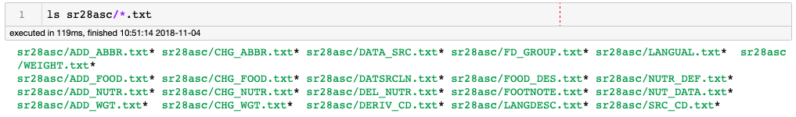
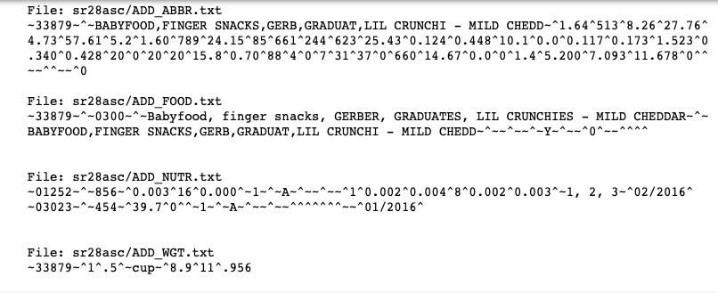
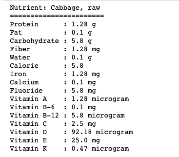
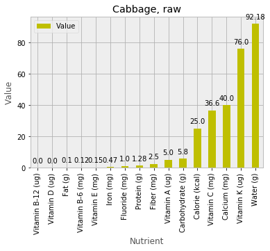
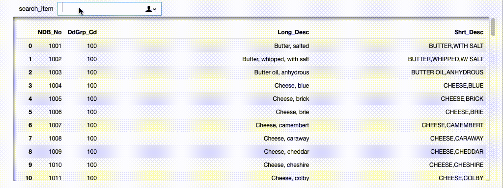
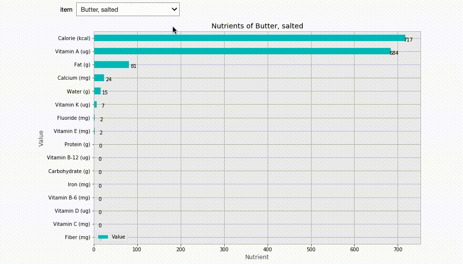

Table of Contents
=================
   * [Data Description](#data-description)
   * [So How Much Fiber we get in Cabbage Raw?](#so-how-much-fiber-we-get-in-cabbage-raw)
   * [I like to search a food item](#i-like-to-search-a-food-item)
   * [Now I know the NDB_No, show me the nutrients](#now-i-know-the-ndb_no-show-me-the-nutrients)

# Data Description

In this project I decided to answer the question "How much nutrients do we consume in our daily life food items?"

For example, when we take a milk shake how much protein does it have? How about Calcium?

Python is my language of choice. I fiddled with the data from United States Department of Agriculture and acquired the relevant dataset.

The data was in relational database format with multiple files relating to each other.

The data appear in relational formats.

There are four principal data files and eight support files

Principal Data Files:
- Food Description file (8,789 items)
- Nutrient Data file (679,045 items)
- Gram Weight file (15,438 items)
- Footnote file (553 items)

Support Files:
- Food Group Description file
- LanguaL Factor file
- LanguaL Factor Description file
- Nutrient Definition file
- Source Code file
- Data Derivation Code Description file
- Sources of Data file
- Sources of Data Link file.



Different datafiles have different numbers of coulumns and they are related in some ways.



At first the dataset looks daunting, however, after taking a quick look at the description pdf file (`sr28_doc.pdf`), 
we get idea how the datasets are interlinked with each others and then can relate various data files.

# So How Much Fiber we get in Cabbage Raw?

I want to see the descriptive table:


I prefer looking bar charts


# I like to search a food item



From search we found following things:
```
SearchTerm  NDB_No ActualProductName
milk shake  1111   Milk shakes, thick chocolate
snacks      19034  Snacks, popcorn, air-popped	
```

# Now I know the NDB_No, show me the nutrients


